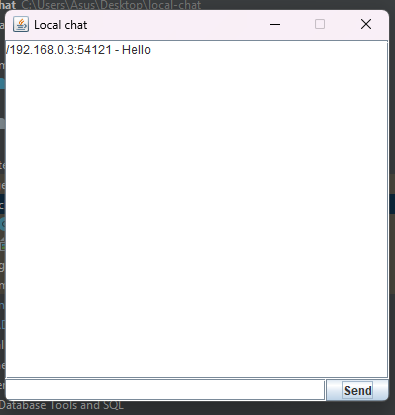

<!-- Here is the main logo and name of your project -->

    <picture>
      
    </picture>
    <h1 align="center">Local Multi-threaded Chat Application in Java</h1>

   
  

   
<b>Table of Contents</b>

- [Demonstration](#demo)
- [Description](#descr)

## Demonstration 🎥

<picture>
      
    </picture>

## Description 📝

> 👋 **Welcome to this project!**
>
> 🛠 **What is it?**  
> Simple multithreaded chat for local communication

